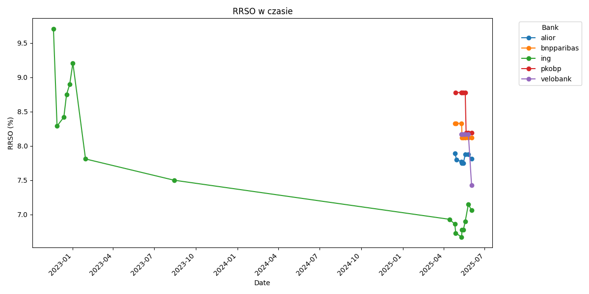
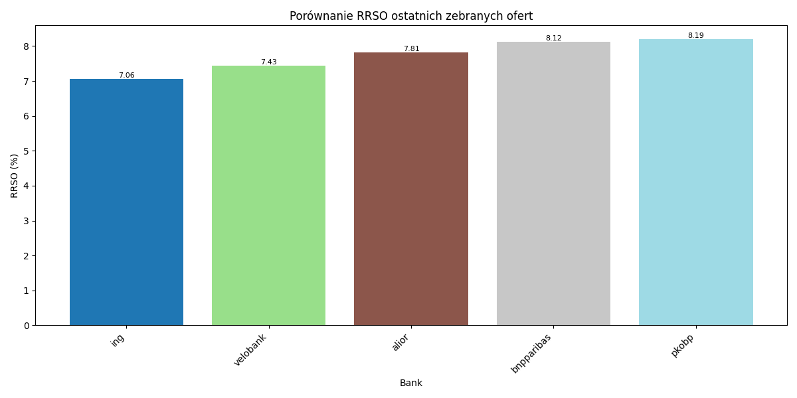
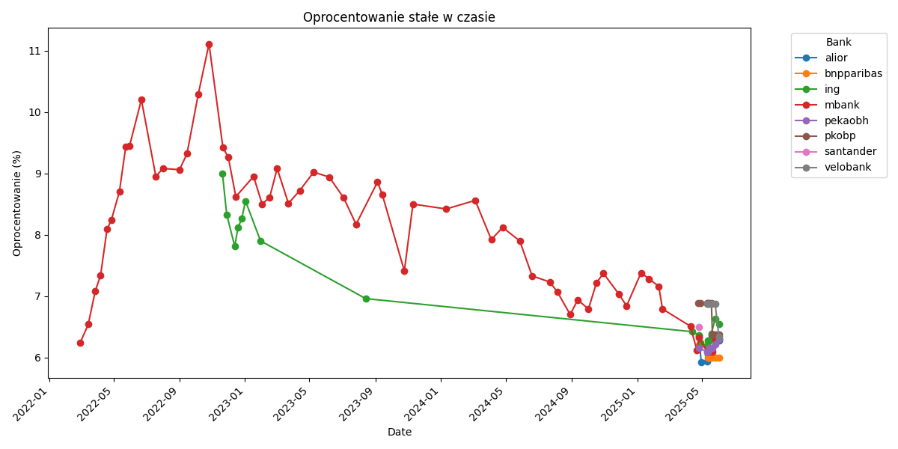

# English

This content is specifically for Polish speakers. It gathers and presents data about mortgage offers in Poland with fixed interest rates. The data is collected from the websites of a number of banks and will be updated regularly. The goal is to provide a trend of the mortgage market in Poland, focusing on fixed-rate offers.

# Polski
To repozytorium zawiera informacje na temat obecnych i przeszłych ofert kredytów hipotecznych z oprocentowaniem stałym w Polsce. Lubię sprawdzać aktualne oferty, dlatego postanowilem zbierać te dane dla sebie jak i również innych. Zbieram tylko wysokość stałego oprocentowania i RRSO z najlepszej oferty jaką znajdę na stronie. Repozytorium jest prowadzone przez mnie, jako projekt ciekawostka, w związku z moim zainteresowaniem trendami ofert z oprocentowaniem stałym w Polsce. 

Do pozyskywania danych korzystam z ogólnodostępnych źródeł, takich jak strony internetowe banków. Dane są czasami podsumowywane przy użyciu LLMa, dlatego mogą być nieprecyzyjne.

Aktualnie zbieram dane z poniższych banków:
- [PKO BP](https://www.pkobp.pl/klient-indywidualny/kredyty-pozyczki/kredyt-lub-pozyczka-ze-stala-stopa-procentowa-przez-5-lat)
- [ING](https://www.ing.pl/indywidualni/kredyty-i-pozyczki/kredyt-hipoteczny/oferty-i-oprocentowanie-stale)
- [BNP Paribas](https://www.bnpparibas.pl/klienci-indywidualni/kredyty/kredyt-hipoteczny-z-niska-marza/stale-oprocentowanie)
- [Alior Bank](https://www.aliorbank.pl/klienci-indywidualni/kredyty-hipoteczne/kredyt-z-okresowo-stala-stopa-oprocentowania.html)
- [Mbank](https://www.mbank.pl/indywidualny/kredyty/kredyty-hipoteczne/chce-kredyt-hipoteczny/) 
- [Santander](https://www.santander.pl/klient-indywidualny/kredyty/kredyt-mieszkaniowy#kredytmieszkaniowy=2) 
- [Pekao Bank Hipoteczny](https://www.pekaobh.pl/strefa-klienta-main/Oprocentowanie#section-2) 

Wykresy

